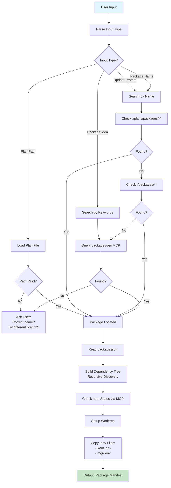
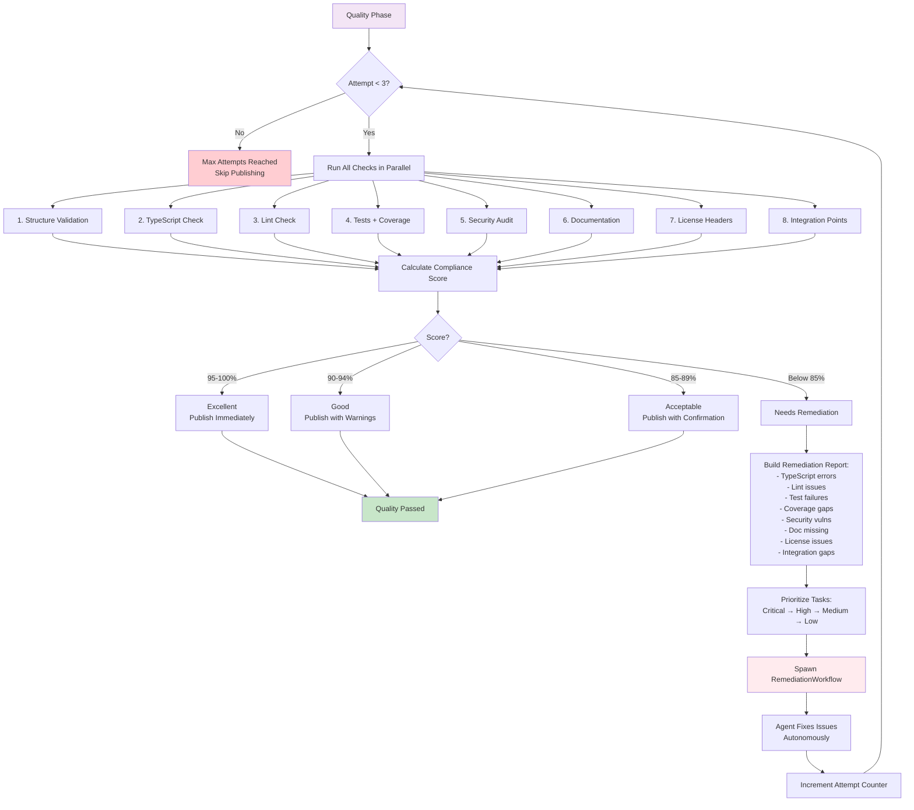
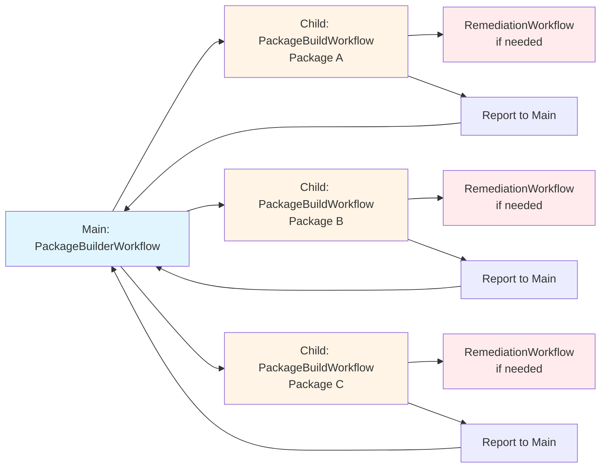

# Autonomous Package Workflow Diagram

## Complete Workflow Overview

```mermaid
graph TD
    Start[User Input: Package Name/Idea/Path/Prompt] --> Discovery

    Discovery[Phase 1: DISCOVERY] --> DiscoveryActivities
    DiscoveryActivities[Parse Input<br/>Search Package<br/>Read package.json<br/>Build Dep Tree<br/>Check npm Status<br/>Setup Worktree<br/>Copy .env Files] --> Planning

    Planning[Phase 2: PLANNING] --> PlanCheck{Plan Exists?}
    PlanCheck -->|Yes| ValidatePlan[Validate Plan<br/>Register with MCP]
    PlanCheck -->|No| AskUser{Ask User:<br/>Provide Plan<br/>or Cancel?}
    AskUser -->|Provide Plan| ValidatePlan
    AskUser -->|Cancel| End[End Workflow]
    ValidatePlan --> MECE

    MECE[Phase 3: MECE VALIDATION] --> AnalyzeMECE[Analyze MECE Compliance]
    AnalyzeMECE --> MECECheck{Violation<br/>Detected?}
    MECECheck -->|No| BuildPhase
    MECECheck -->|Yes| GenerateSplits[Generate Split Plans<br/>Register with MCP]
    GenerateSplits --> IsPublished{Package<br/>Published?}
    IsPublished -->|Yes| DeprecationCycle[Create Deprecation Cycle:<br/>Minor: Add deprecation notice<br/>Major: Split functionality]
    IsPublished -->|No| DirectSplit[Create MECE Split Packages]
    DeprecationCycle --> AddToSuite[Add All Packages to Suite]
    DirectSplit --> AddToSuite
    AddToSuite --> BuildPhase

    BuildPhase[Phase 4: BUILD] --> CreateGraph[Create Dependency Graph<br/>Topological Sort]
    CreateGraph --> SpawnChildren[Spawn Child Workflows<br/>for Each Package]
    SpawnChildren --> ChildWorkflow

    ChildWorkflow[Child: PackageBuildWorkflow] --> BuildPkg[Activity: runBuild<br/>yarn build]
    BuildPkg --> BuildSuccess{Build<br/>Success?}
    BuildSuccess -->|No| ReportBuildFail[Report Build Failure]
    BuildSuccess -->|Yes| QualityPhase

    QualityPhase[Quality Checks] --> QualityActivities[Run in Parallel:<br/>1. Structure Validation<br/>2. TypeScript Check<br/>3. Lint Check<br/>4. Tests + Coverage<br/>5. Security Audit<br/>6. Documentation<br/>7. License Headers<br/>8. Integration Points]
    QualityActivities --> CalcScore[Calculate Compliance Score]
    CalcScore --> ScoreCheck{Score >= 85%?}
    ScoreCheck -->|Yes| PublishPhase
    ScoreCheck -->|No| RemedAttempts{Attempts < 3?}
    RemedAttempts -->|Yes| GenerateRemediation[Generate Remediation Report]
    GenerateRemediation --> RemediationAgent[Spawn RemediationWorkflow]
    RemediationAgent --> AgentFixes[Agent Fixes Issues]
    AgentFixes --> QualityActivities
    RemedAttempts -->|No| SkipPublish[Skip Publishing<br/>Continue Suite]

    PublishPhase[Phase 5: PUBLISH] --> VersionBump[Determine Version Bump]
    VersionBump --> NpmPublish[npm publish<br/>Default: Private]
    NpmPublish --> UpdateDeps[Update Dependent Versions]
    UpdateDeps --> ReportPackage[Report Package Success]

    SkipPublish --> ReportSkipped[Report Package Skipped]
    ReportBuildFail --> ReportSkipped

    ReportPackage --> MorePackages{More Packages<br/>in Suite?}
    ReportSkipped --> MorePackages
    MorePackages -->|Yes| SpawnChildren
    MorePackages -->|No| CompletePhase

    CompletePhase[Phase 6: COMPLETE] --> GatherReports[Gather All Package Reports]
    GatherReports --> WriteSuiteReport[Write Suite Report:<br/>- Packages Built<br/>- Quality Scores<br/>- Remediation Attempts<br/>- MECE Resolutions<br/>- New Packages Created<br/>- Deprecation Cycles]
    WriteSuiteReport --> End

    style Start fill:#e1f5ff
    style Discovery fill:#fff4e6
    style Planning fill:#fff4e6
    style MECE fill:#fff4e6
    style BuildPhase fill:#e8f5e9
    style QualityPhase fill:#f3e5f5
    style PublishPhase fill:#e8f5e9
    style CompletePhase fill:#e8f5e9
    style End fill:#e1f5ff
    style RemediationAgent fill:#ffebee
```



## Phase 1: Discovery (Detailed)



## Phase 3: MECE Validation (Detailed)

```mermaid
graph TD
    Start[MECE Validation Phase] --> Analyze[Analyze MECE Compliance]
    Analyze --> Query[Query packages-api MCP<br/>with Update Context]
    Query --> ViolationCheck{MECE<br/>Violation?}

    ViolationCheck -->|No| NoAction[No MECE Issues]
    NoAction --> Complete[Phase Complete]

    ViolationCheck -->|Yes| IdentifyViolation[Identify Violation Details:<br/>- What functionality violates?<br/>- What new packages needed?<br/>- Dependency relationships?]

    IdentifyViolation --> GenPlans[Generate Plans for<br/>MECE Split Packages]
    GenPlans --> RegisterPlans[Register Plans with MCP]

    RegisterPlans --> PublishedCheck{Current Package<br/>Already Published?}

    PublishedCheck -->|No| CreateNew[Create New MECE Packages<br/>Add to Suite]
    CreateNew --> Complete

    PublishedCheck -->|Yes| DeprecationFlow[Deprecation Cycle Required]
    DeprecationFlow --> MinorBump[Package A v1.1.0:<br/>Add deprecation notice<br/>Update docs]
    MinorBump --> MajorBump[Package A v2.0.0:<br/>Remove split functionality<br/>Add dependency if needed]
    MajorBump --> NewPackage[Package B v1.0.0:<br/>New package with<br/>split functionality]
    NewPackage --> UpdateDeps[Find Dependent Packages]
    UpdateDeps --> CascadeUpdates[Update Dependent Plans<br/>Bump Versions]
    CascadeUpdates --> AddAll[Add All Packages to Suite:<br/>- Original package (2 versions)<br/>- New MECE package<br/>- Updated dependents]
    AddAll --> Complete

    style Start fill:#fff4e6
    style Complete fill:#c8e6c9
    style DeprecationFlow fill:#ffebee
```

## Phase 4.1: Quality Checks (Detailed)



## Child Workflows Overview



## Data Flow Through Phases

```mermaid
graph LR
    Input[Minimal Input:<br/>Name/Idea/Path/Prompt] --> D[Discovery Phase]
    D --> DOut[Package Manifest:<br/>- Name, Path, Version<br/>- Dependencies<br/>- npm Status<br/>- Worktree Path]

    DOut --> P[Planning Phase]
    P --> POut[Validated Plans:<br/>- Main package plan<br/>- Dependency plans<br/>- Registered with MCP]

    POut --> M[MECE Phase]
    M --> MOut[Complete Suite:<br/>- Main package<br/>- Dependencies<br/>- MECE splits<br/>- Deprecation versions<br/>- Updated dependents]

    MOut --> B[Build Phase]
    B --> BOut[Build Results:<br/>- Build success/fail<br/>- Quality scores<br/>- Remediation attempts<br/>- Test results]

    BOut --> Pub[Publish Phase]
    Pub --> PubOut[Publish Results:<br/>- Published versions<br/>- npm URLs<br/>- Deprecation notices<br/>- Updated consumers]

    PubOut --> C[Complete Phase]
    C --> COut[Final Report:<br/>- All packages<br/>- Quality metrics<br/>- MECE resolutions<br/>- New packages created]

    style Input fill:#e1f5ff
    style COut fill:#c8e6c9
```



## Key Decision Points

### 1. Package Discovery
- **Decision**: Package not found locally
- **Options**: Query MCP, ask user, check other branches
- **Outcome**: Package manifest or workflow end

### 2. Plan Availability
- **Decision**: No plan exists
- **Options**: Ask user for plan, user cancels
- **Outcome**: Load plan or graceful exit

### 3. MECE Compliance
- **Decision**: MECE violation detected
- **Options**: Create new packages, handle deprecation cycle
- **Outcome**: Expanded suite with additional packages

### 4. Quality Score
- **Decision**: Score below 85%
- **Options**: Remediation agent (attempts < 3), skip publishing
- **Outcome**: Fixed quality or skipped package

### 5. Publishing
- **Decision**: Quality passed
- **Options**: Publish based on score level
- **Outcome**: Package published to npm

## Activity Distribution

### Discovery Activities (7)
1. parseInput
2. searchForPackage
3. readPackageJson
4. buildDependencyTree
5. checkNpmStatus
6. setupWorktree
7. copyEnvFiles

### Planning Activities (4)
1. searchLocalPlans
2. queryMcpForPlan
3. validatePlan
4. registerPlanWithMcp

### MECE Activities (5)
1. analyzeMeceCompliance
2. generateSplitPlans
3. registerSplitPlans
4. determineDeprecationCycle
5. updateDependentPlans

### Build Activities (1)
1. runBuild

### Quality Activities (9)
1. validatePackageStructure
2. runTypeScriptCheck
3. runLintCheck
4. runTestsWithCoverage
5. runSecurityAudit
6. validateDocumentation
7. validateLicenseHeaders
8. validateIntegrationPoints
9. calculateComplianceScore

### Remediation Activities (1)
1. runRemediationAgent

### Publish Activities (4)
1. determineVersionBump
2. publishToNpm
3. updateDependentVersions
4. publishDeprecationNotice

### Report Activities (2)
1. loadAllPackageReports
2. writeSuiteReport

**Total New Activities: 33**

## Workflow Execution Timeline Example

```
Time 0:00 - User runs: yarn workflow:run openai-client
Time 0:01 - Discovery: Find package, build dep tree (logger, retry-policy, neverhub-adapter)
Time 0:05 - Planning: Validate plans for 4 packages
Time 0:10 - MECE: Check compliance (no violations)
Time 0:15 - Build: Spawn 4 child workflows
  ├─ neverhub-adapter (no deps) - starts immediately
  ├─ retry-policy (no deps) - starts immediately
  └─ Wait for deps...
Time 0:20 - neverhub-adapter completes
Time 0:22 - logger starts (dep ready)
Time 0:25 - retry-policy completes
Time 0:30 - logger completes
Time 0:32 - openai-client starts (deps ready)
Time 0:35 - Quality checks run (all packages)
Time 0:36 - openai-client: coverage 78% (below 90% for core)
Time 0:37 - Remediation agent spawned for openai-client
Time 0:45 - Agent adds tests, re-run quality
Time 0:47 - openai-client: coverage 92% (passed!)
Time 0:50 - Publish: All 4 packages published
Time 0:55 - Complete: Suite report generated
```
