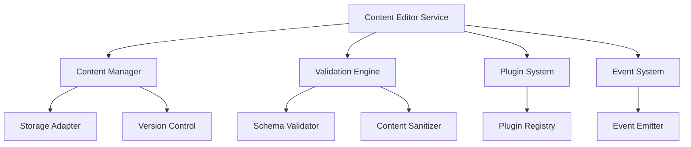

# Implementation Plan: @bernierllc/content-editor-service

## Overview

The `@bernierllc/content-editor-service` is a TypeScript/Node.js package designed to provide comprehensive content editing capabilities. This service will handle content creation, modification, validation, and management operations with a focus on extensibility, type safety, and performance.

**Purpose:**
- Provide a robust content editing API for various content types
- Ensure type-safe operations with comprehensive validation
- Support plugin-based architecture for extensibility
- Maintain audit trails and version control for content changes

## Architecture

### High-Level Design



### Core Components

1. **Content Manager** - CRUD operations and content lifecycle management
2. **Validation Engine** - Schema validation and content sanitization
3. **Plugin System** - Extensible architecture for custom functionality
4. **Event System** - Pub/sub pattern for content events
5. **Storage Adapter** - Abstraction layer for different storage backends

### Technology Stack

- **Runtime:** Node.js 18+
- **Language:** TypeScript 5.0+
- **Testing:** Jest + Supertest
- **Build:** ESBuild
- **Linting:** ESLint + Prettier
- **Documentation:** TypeDoc

## Implementation Steps

### Phase 1: Project Setup and Foundation
- [ ] Initialize npm package with proper metadata
  - [ ] Create `package.json` with dependencies and scripts
  - [ ] Set up TypeScript configuration (`tsconfig.json`)
  - [ ] Configure ESLint and Prettier (`eslint.config.js`, `.prettierrc`)
- [ ] Set up project structure
  ```
  src/
  ├── index.ts
  ├── core/
  │   ├── content-manager.ts
  │   ├── validation-engine.ts
  │   └── types.ts
  ├── plugins/
  │   ├── plugin-registry.ts
  │   └── base-plugin.ts
  ├── events/
  │   └── event-emitter.ts
  ├── storage/
  │   ├── storage-adapter.ts
  │   └── memory-adapter.ts
  └── utils/
      ├── logger.ts
      └── errors.ts
  ```
- [ ] Configure build system with ESBuild
- [ ] Set up Jest testing environment
- [ ] Create initial TypeScript interfaces and types

### Phase 2: Core Type Definitions
- [ ] Define core interfaces in `src/core/types.ts`
  ```typescript
  export interface ContentItem {
    id: string;
    type: string;
    content: Record<string, any>;
    metadata: ContentMetadata;
    version: number;
    createdAt: Date;
    updatedAt: Date;
  }

  export interface ContentMetadata {
    author: string;
    tags: string[];
    status: ContentStatus;
  }

  export enum ContentStatus {
    DRAFT = 'draft',
    PUBLISHED = 'published',
    ARCHIVED = 'archived'
  }
  ```
- [ ] Define service configuration interfaces
- [ ] Create error type definitions
- [ ] Define plugin and event interfaces

### Phase 3: Storage Layer Implementation
- [ ] Implement base storage adapter interface (`src/storage/storage-adapter.ts`)
  ```typescript
  export interface IStorageAdapter {
    create(content: ContentItem): Promise<ContentItem>;
    read(id: string): Promise<ContentItem | null>;
    update(id: string, updates: Partial<ContentItem>): Promise<ContentItem>;
    delete(id: string): Promise<boolean>;
    list(filters?: ContentFilters): Promise<ContentItem[]>;
  }
  ```
- [ ] Implement in-memory storage adapter for testing
- [ ] Add storage adapter factory pattern
- [ ] Create storage-related error handling

### Phase 4: Content Manager Implementation
- [ ] Implement core content manager (`src/core/content-manager.ts`)
  ```typescript
  export class ContentManager {
    constructor(
      private storage: IStorageAdapter,
      private validator: ValidationEngine,
      private eventEmitter: EventEmitter
    ) {}

    async createContent(content: CreateContentRequest): Promise<ContentItem> {
      // Implementation
    }

    async updateContent(id: string, updates: UpdateContentRequest): Promise<ContentItem> {
      // Implementation
    }
  }
  ```
- [ ] Implement CRUD operations with validation
- [ ] Add content versioning logic
- [ ] Integrate event emission for content operations
- [ ] Add transaction support for complex operations

### Phase 5: Validation Engine
- [ ] Implement validation engine (`src/core/validation-engine.ts`)
  ```typescript
  export class ValidationEngine {
    private schemas: Map<string, JSONSchema> = new Map();

    registerSchema(contentType: string, schema: JSONSchema): void {
      // Implementation
    }

    validate(content: ContentItem): ValidationResult {
      // Implementation
    }

    sanitize(content: Record<string, any>): Record<string, any> {
      // Implementation
    }
  }
  ```
- [ ] Integrate JSON Schema validation
- [ ] Implement content sanitization (XSS prevention)
- [ ] Add custom validation rules support
- [ ] Create validation error reporting

### Phase 6: Plugin System
- [ ] Implement base plugin class (`src/plugins/base-plugin.ts`)
- [ ] Create plugin registry (`src/plugins/plugin-registry.ts`)
  ```typescript
  export class PluginRegistry {
    private plugins: Map<string, IPlugin> = new Map();

    register(plugin: IPlugin): void {
      // Implementation
    }

    execute(hook: string, context: PluginContext): Promise<PluginResult> {
      // Implementation
    }
  }
  ```
- [ ] Define plugin lifecycle hooks
- [ ] Implement plugin dependency resolution
- [ ] Add plugin configuration management

### Phase 7: Event System
- [ ] Implement event emitter (`src/events/event-emitter.ts`)
- [ ] Define standard content events
  ```typescript
  export enum ContentEvents {
    CREATED = 'content:created',
    UPDATED = 'content:updated',
    DELETED = 'content:deleted',
    PUBLISHED = 'content:published'
  }
  ```
- [ ] Add event middleware support
- [ ] Implement async event handling
- [ ] Create event subscription management

### Phase 8: Service Integration
- [ ] Implement main service class (`src/index.ts`)
  ```typescript
  export class ContentEditorService {
    constructor(private config: ServiceConfig) {
      // Initialize all components
    }

    async initialize(): Promise<void> {
      // Service initialization
    }

    getContentManager(): ContentManager {
      return this.contentManager;
    }
  }
  ```
- [ ] Create service factory with configuration
- [ ] Implement graceful shutdown handling
- [ ] Add health check endpoints
- [ ] Integrate all components with proper dependency injection

### Phase 9: Advanced Features
- [ ] Implement content search and filtering
- [ ] Add content export/import functionality
- [ ] Create content templates system
- [ ] Implement content workflow management
- [ ] Add content analytics and metrics

### Phase 10: Documentation and Examples
- [ ] Generate TypeDoc documentation
- [ ] Create comprehensive README.md
- [ ] Write usage examples and tutorials
- [ ] Create migration guides
- [ ] Document plugin development guide

## Testing Strategy

### Unit Testing
- [ ] Test coverage target: 90%+ line coverage
- [ ] Mock all external dependencies
- [ ] Test files location: `__tests__/unit/`
- [ ] Example test structure:
  ```typescript
  describe('ContentManager', () => {
    let contentManager: ContentManager;
    let mockStorage: jest.Mocked<IStorageAdapter>;

    beforeEach(() => {
      mockStorage = createMockStorageAdapter();
      contentManager = new ContentManager(mockStorage, mockValidator, mockEventEmitter);
    });

    describe('createContent', () => {
      it('should create content with valid input', async () => {
        // Test implementation
      });
    });
  });
  ```

### Integration Testing
- [ ] Test component interactions
- [ ] Use real storage adapters in test environment
- [ ] Test files location: `__tests__/integration/`
- [ ] Test plugin system integration
- [ ] Test event system end-to-end

### Performance Testing
- [ ] Benchmark content operations
- [ ] Test memory usage patterns
- [ ] Validate concurrent operation handling
- [ ] Load testing with large content sets

### Testing Configuration
```json
{
  "jest": {
    "preset": "ts-jest",
    "testEnvironment": "node",
    "collectCoverageFrom": [
      "src/**/*.ts",
      "!src/**/*.d.ts"
    ],
    "coverageThreshold": {
      "global": {
        "branches": 90,
        "functions": 90,
        "lines": 90,
        "statements": 90
      }
    }
  }
}
```

## Quality Requirements

### Code Quality Standards
- [ ] **TypeScript Strict Mode:** Enabled with no `any` types
- [ ] **ESLint Rules:** Extend `@typescript-eslint/recommended` and `prettier`
- [ ] **Code Coverage:** Minimum 90% line coverage
- [ ] **Documentation:** All public APIs must have TSDoc comments
- [ ] **Complexity:** Maximum cyclomatic complexity of 10 per function

### Performance Standards
- [ ] **Memory Usage:** No memory leaks, proper cleanup
- [ ] **Response Time:** Content operations under 100ms (in-memory)
- [ ] **Throughput:** Handle 1000+ concurrent operations
- [ ] **Bundle Size:** Keep package size under 1MB

### Security Standards
- [ ] **Input Validation:** All inputs validated and sanitized
- [ ] **XSS Prevention:** Content sanitization for web contexts
- [ ] **Audit:** Regular dependency security audits
- [ ] **No Secrets:** No hardcoded secrets or sensitive data

### Build Quality Gates
```yaml
# CI/CD Pipeline Gates
- lint_check: ESLint must pass with 0 errors
- type_check: TypeScript compilation must succeed
- test_coverage: Minimum 90% coverage required
- security_audit: npm audit must show 0 high/critical vulnerabilities
- build_success: Package must build without errors
```

## Dependencies

### External Dependencies
```json
{
  "dependencies": {
    "ajv": "^8.12.0",
    "dompurify": "^3.0.5",
    "eventemitter3": "^5.0.1",
    "uuid": "^9.0.1"
  },
  "devDependencies": {
    "@types/jest": "^29.5.5",
    "@types/node": "^20.8.0",
    "@typescript-eslint/eslint-plugin": "^6.7.4",
    "@typescript-eslint/parser": "^6.7.4",
    "esbuild": "^0.19.4",
    "eslint": "^8.50.0",
    "jest": "^29.7.0",
    "prettier": "^3.0.3",
    "ts-jest": "^29.1.1",
    "typedoc": "^0.25.2",
    "typescript": "^5.2.2"
  }
}
```

### Internal Dependencies
- **Shared Types:** May depend on `@bernierllc/shared-types` if available
- **Logging:** Consider `@bernierllc/logger` for consistent logging
- **Configuration:** May integrate with `@bernierllc/config-service`

### Optional Dependencies
- **Database Adapters:** MongoDB, PostgreSQL adapters as optional installs
- **Cloud Storage:** AWS S3, Azure Blob storage adapters
- **Search Engine:** Elasticsearch integration for advanced search

### Peer Dependencies
```json
{
  "peerDependencies": {
    "node": ">=18.0.0"
  }
}
```

---

This implementation plan provides a comprehensive roadmap for building a robust, type-safe, and extensible content editor service. Each phase builds upon the previous one, ensuring a solid foundation while maintaining flexibility for future enhancements.