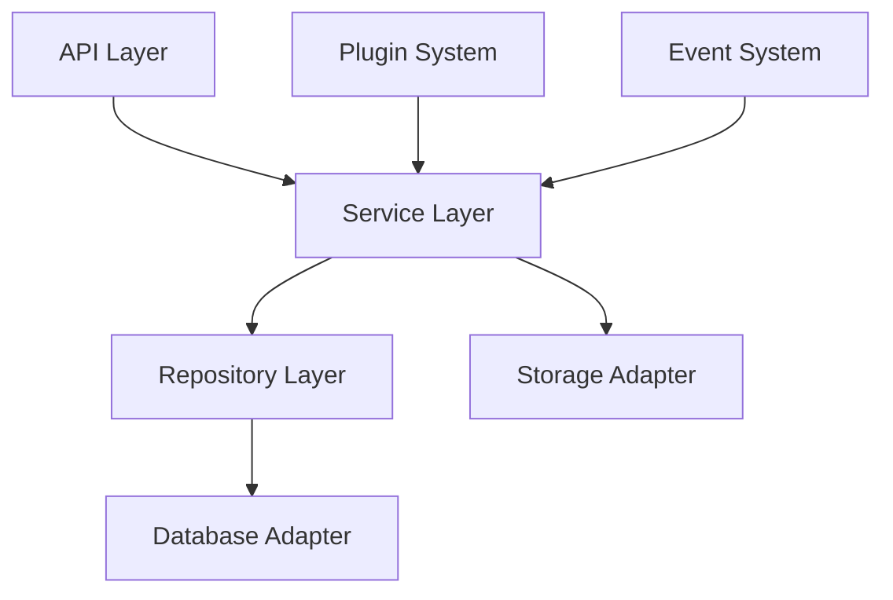

# Implementation Plan: @bernierllc/content-management-suite

## Overview

The `@bernierllc/content-management-suite` is a comprehensive TypeScript/Node.js package designed to provide a robust content management system with features for content creation, editing, versioning, and publishing. This package aims to offer a flexible and extensible solution for managing various content types including articles, media files, and structured data.

### Key Features
- Content CRUD operations with versioning
- Media asset management
- Content workflow and approval system
- Search and filtering capabilities
- Plugin architecture for extensibility
- REST API endpoints
- TypeScript-first design with comprehensive type safety

## Architecture

### High-Level Design



### Core Components

- **API Layer**: Express.js-based REST endpoints
- **Service Layer**: Business logic and orchestration
- **Repository Layer**: Data access abstraction
- **Storage System**: File and media management
- **Plugin Architecture**: Extensible functionality
- **Event System**: Pub/sub for loose coupling

### Technology Stack

- **Runtime**: Node.js 18+
- **Language**: TypeScript 5.0+
- **Database**: PostgreSQL with TypeORM
- **Storage**: AWS S3 compatible
- **Testing**: Jest + Supertest
- **Build**: tsup for bundling
- **Documentation**: TypeDoc

## Implementation Steps

### Phase 1: Project Setup and Core Infrastructure

- [ ] Initialize npm package with proper `package.json`
  ```json
  {
    "name": "@bernierllc/content-management-suite",
    "version": "1.0.0",
    "main": "./dist/index.js",
    "types": "./dist/index.d.ts"
  }
  ```

- [ ] Setup TypeScript configuration (`tsconfig.json`)
- [ ] Configure build tooling with `tsup`
- [ ] Setup ESLint and Prettier configurations
- [ ] Initialize Git repository with proper `.gitignore`
- [ ] Setup GitHub Actions for CI/CD (`.github/workflows/ci.yml`)
- [ ] Create basic project structure:
  ```
  src/
  ├── api/
  ├── services/
  ├── repositories/
  ├── models/
  ├── types/
  ├── utils/
  └── index.ts
  ```

### Phase 2: Core Data Models and Types

- [ ] Define core TypeScript interfaces in `src/types/`
  - [ ] `Content` interface (`src/types/content.ts`)
  - [ ] `User` interface (`src/types/user.ts`)
  - [ ] `Media` interface (`src/types/media.ts`)
  - [ ] `Workflow` interface (`src/types/workflow.ts`)

- [ ] Create database entities using TypeORM
  - [ ] `ContentEntity` (`src/models/content.entity.ts`)
  - [ ] `UserEntity` (`src/models/user.entity.ts`)
  - [ ] `MediaEntity` (`src/models/media.entity.ts`)

- [ ] Setup database configuration and migrations
  - [ ] Database connection setup (`src/config/database.ts`)
  - [ ] Migration scripts (`src/migrations/`)

### Phase 3: Repository Layer Implementation

- [ ] Create base repository interface (`src/repositories/base.repository.ts`)
- [ ] Implement content repository (`src/repositories/content.repository.ts`)
  ```typescript
  export interface IContentRepository {
    create(content: CreateContentDto): Promise<Content>;
    findById(id: string): Promise<Content | null>;
    update(id: string, updates: UpdateContentDto): Promise<Content>;
    delete(id: string): Promise<void>;
    findByFilters(filters: ContentFilters): Promise<Content[]>;
  }
  ```

- [ ] Implement user repository (`src/repositories/user.repository.ts`)
- [ ] Implement media repository (`src/repositories/media.repository.ts`)
- [ ] Add repository unit tests

### Phase 4: Service Layer Development

- [ ] Create content management service (`src/services/content.service.ts`)
  - [ ] Content CRUD operations
  - [ ] Version management
  - [ ] Content validation

- [ ] Create media management service (`src/services/media.service.ts`)
  - [ ] File upload handling
  - [ ] Image processing
  - [ ] Storage integration

- [ ] Create workflow service (`src/services/workflow.service.ts`)
  - [ ] Content approval workflows
  - [ ] State management
  - [ ] Notification system

- [ ] Implement search service (`src/services/search.service.ts`)
- [ ] Add comprehensive service tests

### Phase 5: API Layer Implementation

- [ ] Setup Express.js application (`src/api/app.ts`)
- [ ] Create API routes:
  - [ ] Content routes (`src/api/routes/content.routes.ts`)
  - [ ] Media routes (`src/api/routes/media.routes.ts`)
  - [ ] User routes (`src/api/routes/user.routes.ts`)

- [ ] Implement middleware:
  - [ ] Authentication middleware (`src/api/middleware/auth.middleware.ts`)
  - [ ] Validation middleware (`src/api/middleware/validation.middleware.ts`)
  - [ ] Error handling middleware (`src/api/middleware/error.middleware.ts`)

- [ ] Add OpenAPI/Swagger documentation
- [ ] Implement API integration tests

### Phase 6: Plugin System and Event Architecture

- [ ] Create plugin interface (`src/plugins/plugin.interface.ts`)
- [ ] Implement plugin manager (`src/plugins/plugin.manager.ts`)
- [ ] Setup event system (`src/events/event.manager.ts`)
- [ ] Create sample plugins for demonstration
- [ ] Document plugin development guide

### Phase 7: Storage and Configuration

- [ ] Implement storage adapters:
  - [ ] Local filesystem adapter (`src/storage/local.adapter.ts`)
  - [ ] S3 adapter (`src/storage/s3.adapter.ts`)

- [ ] Create configuration management (`src/config/index.ts`)
- [ ] Environment variable validation
- [ ] Configuration schema documentation

### Phase 8: CLI Tools and Utilities

- [ ] Create CLI entry point (`src/cli/index.ts`)
- [ ] Implement migration commands
- [ ] Add content import/export utilities
- [ ] Create development server command

### Phase 9: Documentation and Examples

- [ ] Generate TypeDoc documentation
- [ ] Create comprehensive README.md
- [ ] Write usage examples (`examples/`)
- [ ] Create migration guides
- [ ] Setup documentation website

### Phase 10: Final Polish and Release

- [ ] Performance optimization and profiling
- [ ] Security audit and fixes
- [ ] Final testing and bug fixes
- [ ] Package optimization and tree-shaking
- [ ] Release preparation and versioning

## Testing Strategy

### Unit Testing
- **Framework**: Jest with TypeScript support
- **Coverage Target**: 90% line coverage minimum
- **Location**: `__tests__/unit/` directory structure mirroring `src/`

```typescript
// Example test structure
describe('ContentService', () => {
  let contentService: ContentService;
  let mockRepository: jest.Mocked<IContentRepository>;

  beforeEach(() => {
    mockRepository = createMockRepository();
    contentService = new ContentService(mockRepository);
  });

  it('should create content successfully', async () => {
    // Test implementation
  });
});
```

### Integration Testing
- **Framework**: Jest + Supertest for API testing
- **Database**: Test database with migrations
- **Location**: `__tests__/integration/`

### End-to-End Testing
- **Framework**: Jest with test database
- **Scope**: Complete workflows from API to database
- **Location**: `__tests__/e2e/`

### Performance Testing
- **Load testing**: Artillery.js for API endpoints
- **Memory profiling**: Node.js built-in profiler
- **Benchmark tests**: For critical operations

## Quality Requirements

### Code Quality Standards
- **TypeScript**: Strict mode enabled, no `any` types
- **ESLint**: Extends `@typescript-eslint/recommended`
- **Prettier**: Consistent code formatting
- **Husky**: Pre-commit hooks for linting and testing

### Build Requirements
- **Zero build errors**: TypeScript compilation must succeed
- **Bundle size**: < 1MB minified + gzipped
- **Tree-shaking**: Support for unused code elimination
- **Type declarations**: Complete `.d.ts` files generated

### Security Standards
- **Dependencies**: Regular security audits with `npm audit`
- **Input validation**: All API inputs validated with Joi/Zod
- **SQL injection**: Prevention through ORM usage
- **Authentication**: JWT-based with proper validation

### Performance Benchmarks
- **API response time**: < 200ms for 95th percentile
- **Database queries**: N+1 query prevention
- **Memory usage**: < 100MB baseline memory footprint

## Dependencies

### Production Dependencies
```json
{
  "express": "^4.18.2",
  "typeorm": "^0.3.17",
  "pg": "^8.11.3",
  "jsonwebtoken": "^9.0.2",
  "multer": "^1.4.5-lts.1",
  "aws-sdk": "^2.1467.0",
  "joi": "^17.11.0",
  "winston": "^3.11.0"
}
```

### Development Dependencies
```json
{
  "typescript": "^5.2.2",
  "jest": "^29.7.0",
  "@types/jest": "^29.5.5",
  "supertest": "^6.3.3",
  "eslint": "^8.51.0",
  "@typescript-eslint/eslint-plugin": "^6.7.4",
  "prettier": "^3.0.3",
  "tsup": "^7.2.0",
  "typedoc": "^0.25.2"
}
```

### Peer Dependencies
- Node.js >= 18.0.0
- PostgreSQL >= 12.0

### Internal Dependencies
- Configuration management system
- Logging infrastructure
- Error handling utilities
- Type definition consistency across modules

### External Service Dependencies
- **Database**: PostgreSQL instance
- **Storage**: S3-compatible storage service
- **Cache** (optional): Redis for session/cache management
- **Search** (optional): Elasticsearch for advanced search features

---

**Note**: This implementation plan serves as a comprehensive roadmap for developing the content management suite. Each phase should be completed with proper testing and documentation before proceeding to the next phase. Regular code reviews and stakeholder feedback should be incorporated throughout the development process.